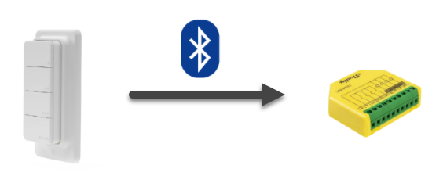

# Shelly BLE Button to Dimmer - direct connection
The idea is simple: Have a Shelly BLU RC Button 4 which controls a dimmer, like the Shelly Plus RGBW PM.

As it turned out, it would require either a connection to Shelly Cloud or some other kind of server, like HomeAssistant.  
However, the goal was to have none of them but have a direct connection between button and dimmer instead.

That's where Shelly Scripting comes in handy: The script starts a BLE scan, and its result is being processed in a callback function.  
The rest is pretty straight-forward: Parse the BLE advertisement frame and execute the desired Shelly actions.

Reference to the relevant documentation can be found inside the source.
